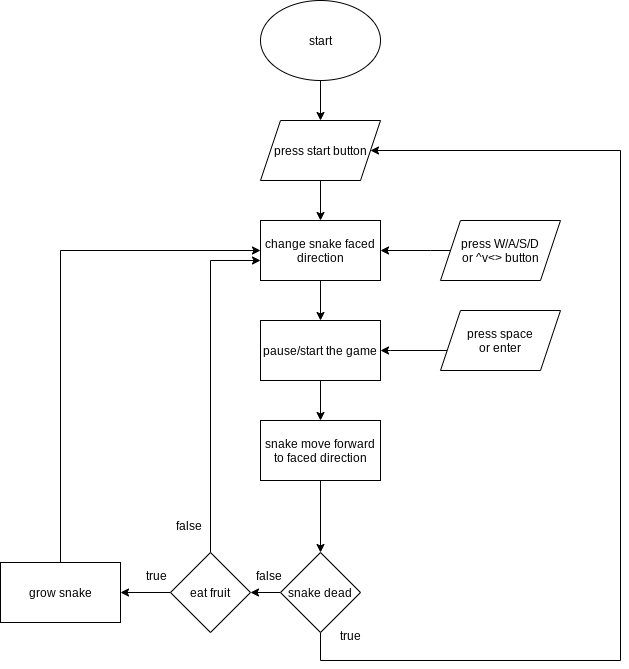
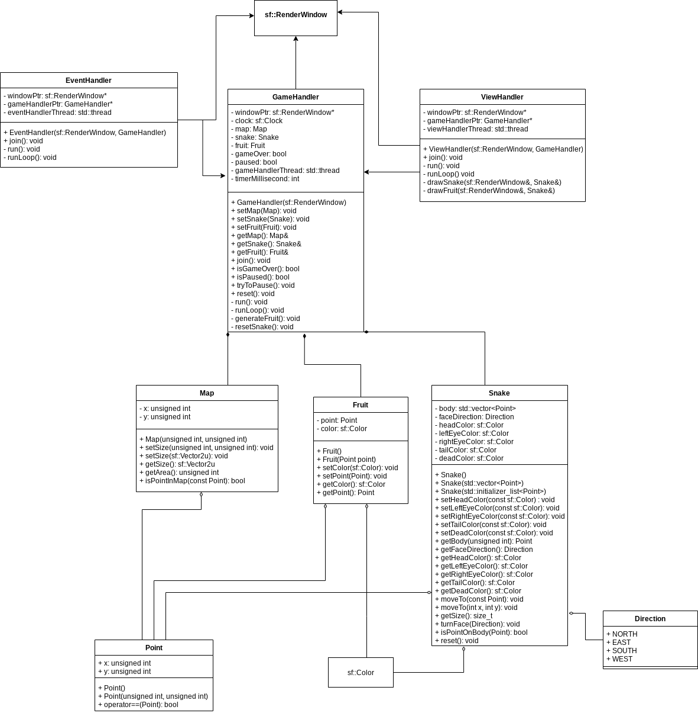

# snakeGameDescription
This project is a description for snakeGame. (link: https://github.com/lusterofgem/snakeGame) 
Snake game is a classic minigame. 
When the snake eat a fruit, the snake will grow up. 
When the snake hit in the wall or itself, the snake will dead. 
The longer the snake grow, the more point player get. 
## Flow Chart
 
## Class Diagram
We use a sf::RenderWindow and three handler to run this game. 
We try to fit this game in model-view-control structure. 
sf::RenderWindow is the visible window, the main window of this game. 
Every handler have a thread, that means the game logic and render are seperate into different thread. 
That means if the render stuck a little bit, the game logic will keep running. 
GameHandler run the game logic, forward the snake, eat fruit, or detect if the snake is dead. 
EventHandler detect the window input, like hit exit button or press WASD, it will change the status of GameHandler. 
ViewHandler render the GameHandler status to the window. 
 
